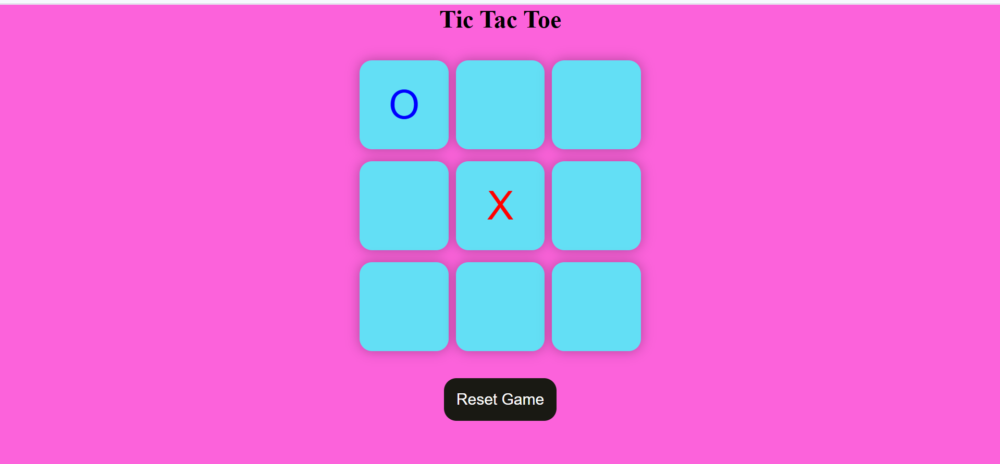

# 🎯 Tic Tac Toe

A web-based **Tic Tac Toe** game for two players, built using **HTML**, **CSS**, and **JavaScript**. Simple logic, clean design, and quick fun!

---

## 🎮 Features

- 🔢 Two-player gameplay
- 🧠 Win and draw detection
- 🌀 Instant restart after each round
- 📱 Responsive design for all screen sizes

---

## 🛠 Technologies Used

- HTML5
- CSS3
- JavaScript (DOM manipulation)

---

## 📸 Game Preview

